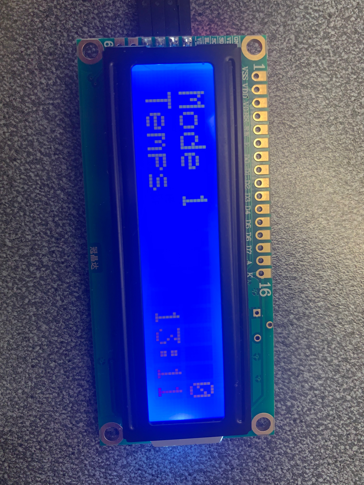
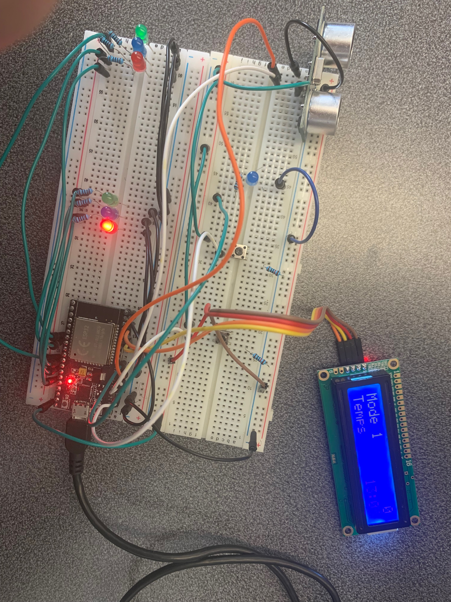

| Targets | ESP32 | ESP32-C2 | ESP32-C3 | ESP32-S2 | ESP32-S3 |
|---------|-------|----------|----------|----------|----------|

# _Traffic_

Ce projet simule une intersection a l'aide d'un ESP32 sur FreeRTOS.
La simulation utilise plusieur composant pour refleter la réalité.
Nous avons des lumiere de circulation pour une voie principale et secondaire, un detecteur de distance qui permet de
limiter le temps d'attente d'une voiture.
Une lumière permet d'ouvrir et fermer une voie d'autobus selon une plage horaire.
Deux bouton permettent l'altération de la simulation: un bouton peut changer le mode de temps, le mode détermine
l'équivalent d'une seconde dans la simulation:

- Mode 1: 1 seconde = 1 minute
- Mode 2: 1 seconde = 2 minute
- Mode 3: 1 seconde = 3 minute

Le mode, le temps et le temps d'attente d'un véhicule sont affiché sur un écran LED



## Code

Le projet à été créer avec le language C et utilise CMake. La configuration de construction du projet est contenue
dans `CMakeLists.txt`
fichiers qui fournissent un ensemble de directives et d'instructions décrivant les fichiers source et les cibles du
projet
(exécutable, bibliothèque ou les deux).

Vous trouverez ci-dessous une brève explication des fichiers restants dans le dossier du projet.

```
├── components
│   ├── delayer
│         Le delayer a des fonctions utilitaires qui permet
│         de gérer les ticks dans un esp32.
│   ├── lcd_controller
│         C'est une bibliothèque custom qui permet de gérer
│         la communication en i2c avec l'écran LCD.
│   ├── mode
│         Tous se qui a rapport au mode est dans ce composant
│   ├── simulation
│         La simulation est le temps qui se passe dans celle-ci.
│   ├── sonar
│         Le sonar sur le breadboard
│   ├── traffic_light
│         Le code qui gère les lumière de traffique.
├── main
│   ├── CMakeLists.txt
│   ├── idf_component.yml # Les composants qu'on utilise        
│   └── main.c # l'entrée de l'application
└── README.md # Le fichier que tu lis présentement
└── CMakeLists.txt 
```

### Difficulté du code

- Au début, le fichier `main.c` commencait à avoir beaucoup de lignes de code, donc on a décider de
créer des composants idf. J'ai eu des problèmes en essayant de créer des composants, parce que la docs
de esp-idf ne montre pas vraiment ça. Finalement par contre, on a réussi à créer des composants pour
bien séparer la responsabilité du code.
- Aussi, un moment donné, le ESP32 arrêtais pas de reboot sans afficher de message d'erreur. l'ESP32
supprimais un handle de task qui n'existait pas, alors l'application ne savais pas comment régler ça
et ça rebootais. Heureusement, on a découvert assez vite qu'il faut s'assurer de regarder le handle à NULL
avant de delete et cela a fix notre problème.
- Aussi, le bouton pour changer l'état des lumières était mélangeant. Au début, j'avais fais en sorte que quand on 
clique sur ce bouton, la lumière changais de vert à jaune, jaune à rouge etc. Mais, on a réalisé en classe que c'était
de changer l'état des deux lumières d'intersections. Le meilleur moyen qu'on a trouvé était de supprimer les anciennes taches
et d'en créer deux nouvelles pour les lumières de traffique.

## Filage

### Difficulté du fillage

- Durant la première tentative de création du circuit, une de nos led n'allumait pas. Ne sachant pas pourquoi, nous
  avons déconstruit le circuit
  entier pour le reconstruire. Le problème est parti de lui même mais ma théorie est que le GPIO n'a pas été reset.
  Ayant eu le même problemes un autre fois, et l'ayant règlé de cette manière.


- Un autre problème rencontrer fut que lors de la construction du deuxième circuit, nosu avons mamquer de place sur le
  board.
  La solution a été de rajouter un board.


- Lors du fillage du bouton de reset des lumière, mon erreur a été que j'ai brancher le bouton dans un GPIO de reset.
  Cela
  avait pour cause de rebooter le système entier. Nous avons donc éviter tout le long du projet d'utiliser le GPIO 0 et
  2 car ces deux avait le même
  résultat sur l'ESP-32.

### Fillage Finale

- Au finale, Le fillage ressemble à ceci :
  

### Organisation du fillage

- Sur le board à gauche, on voit ici que ce sont les 6 led qui sont misent. Puisque 6 led prend assez de place en
  fillage,
  j'ai déside de mettre cela comme sa.


- De l'autre côté, j'ai brancher le 5v à la colonne plus et le GND à la colonne moins.
  Tout les autre system son brancher sur ce board. J'ai donc tout organiser le fillage pour essayer d'avoir le plus de
  place pour travailler.
