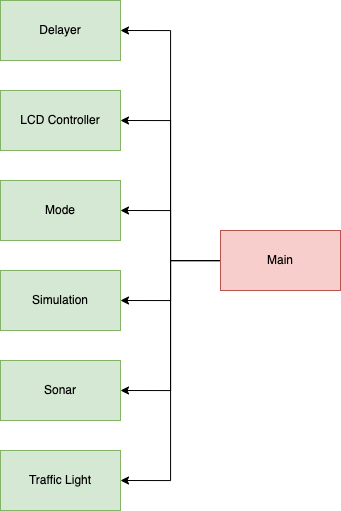

\tableofcontents

\newpage


| Architecture | ESP32 | ESP32-C2 | ESP32-C3 | ESP32-S2 | ESP32-S3 |
|--------------|-------|----------|----------|----------|----------|


# _Traffic_

Ce projet simule une intersection à l'aide d'un ESP32 sur FreeRTOS. La simulation utilise plusieurs composants pour refléter la réalité.
Nous avons des lumières de circulation pour une voie principale et secondaire,
un détecteur de distance qui permet de limiter le temps d'attente d'une voiture.
Une lumière permet d'ouvrir et fermer une voie d'autobus selon une plage horaire.

Deux boutons permettent certains changements. 

Un bouton peut changer le mode de temps, le mode détermine l'équivalent d'une seconde dans la simulation.
Le mode, le temps et le temps d'attente d'un véhicule sont affichés sur un écran LED.

## Créer le PDF

```shell
pandoc README.md -o readme.pdf
```

## Code

Trouver le /dev/tty* à flasher.

```shell
idf.py -p /dev/tty.usbserial-0001 flash
```

Le projet a été créé avec le langage C et utilise CMake. La configuration de construction du projet est contenue dans `CMakeLists.txt` 
fichiers qui fournissent un ensemble de directives et d'instructions décrivant les fichiers source et les cibles du projet (exécutable, 
bibliothèque ou les deux).

Vous trouverez ci-dessous une brève explication des fichiers restants dans le dossier du projet.

\newpage

```
|- components
|   |- delayer
|         Le delayer a des fonctions utilitaires qui permettent
|         de gérer les ticks dans un esp32.
|   |- lcd_controller
|         C'est une bibliothèque custom qui permet de gérer
|         la communication en i2c avec l'écran LCD.
|   |- mode
|         Tout ce qui a rapport au mode est dans ce composant
|   |- simulation
|         La simulation est le temps qui se passe dans celle-ci.
|   |- sonar
|         Le sonar sur le breadboard
|   |- traffic_light
|         Le code qui gère les lumières de trafic.
|- main
|   |- CMakeLists.txt
|   |- idf_component.yml # Les composants qu'on utilise        
|   |_ main.c # l'entrée de l'application
|_ README.md # Le fichier que tu lis présentement
|_ CMakeLists.txt 
```

\newpage

### Difficulté du code

- Au début, le fichier `main.c` commençait à avoir beaucoup de lignes de code, donc on a décidé de créer des composants idf. J'ai eu des 
problèmes en essayant de créer des composants, parce que la doc d’ESP-idf ne montre pas vraiment ça. Finalement par contre, on a réussi à 
créer des composants pour bien séparer la responsabilité du code.

- Aussi, un moment donné, le ESP32 n’arrêtait pas de redémarrer sans afficher de message d'erreur. L'ESP32 supprimait un handle de task qui 
n'existait pas, alors l'application ne savait pas comment régler ça et ça redémarrait. Heureusement, on a découvert assez vite qu'il faut 
s'assurer de regarder le handle à NULL avant de supprimer et cela a réglé notre problème.

- Aussi, le bouton pour changer l'état des lumières était mélangeant. Au début, j'avais fait en sorte que quand on  clique sur ce bouton, la 
lumière changeait de vert à jaune, jaune à rouge, etc. Mais, on a réalisé en classe que c'était de changer l'état des deux lumières 
d'intersections. Le meilleur moyen qu'on a trouvé était de supprimer les anciennes taches et d'en créer deux nouvelles pour les lumières de 
trafic.

### Structure du code

**Delayer**

Le delayer a des fonctions utilitaires qui permettent de gérer les ticks dans un esp32. C'est une librairie qui est utilisée pas mal partout
dans le code et à travers les composants. Si on veut ajouter d'autres utilitaires qui ont rapport au ticker, on les mettrait ici.

**LCD Controller**

Le lcd controller est une librairie maison qui est basée sur le PDF [HD44780.pdf](https://www.sparkfun.com/datasheets/LCD/HD44780.pdf).
Nous avons plusieurs fonctions, qui permettent de travailler avec l'écran (envoyer des strings, déplacer le curseur et écrire à partir de la
fin).

**Mode**

Pour gérer le mode, on a une valeure globale qui garde un `uint8_t` pour le stocker, donc de 0 à 255.

- Mode 1: 1 seconde = 1 minute
- Mode 2: 1 seconde = 2 minutes
- Mode 3: 1 seconde = 3 minutes

Le mode, le temps et le temps d'attente d'un véhicule sont affiché sur un écran LED

**Simulation**

La simulation est le temps qui se passe dans celle-ci.

**Sonar**

Le sonar sur le breadboard. Permet de détecter la distance d'une auto.

**Traffic Light**

Le code qui gère les feux de circulation.

### Diagramme finale



## Filage

### Difficulté du filage

- Durant la première tentative de création du circuit, une de nos led n'allumait pas. Ne sachant pas pourquoi, nous   avons déconstruit le 
circuit   entier pour le reconstruire. Le problème est parti de lui-même, mais ma théorie est que le GPIO n'a pas été redémarrer.
Ayant eu le même problème une autre fois, et l'ayant réglé de cette manière.

- Un autre problème rencontrer fut que lors de la construction du deuxième circuit, nous avons manqué de place sur le   board.
La solution a été de rajouter un board.

- Pendant la connexion du bouton reset des lumières, mon erreur a été que j'ai branché le bouton dans un GPIO de reset.
Cela avait pour cause de redémarrer le système entier. Nous avons donc évité tout le long du projet d'utiliser le GPIO 0 et 2, car ces deux 
avaient le même résultat sur l'ESP-32.

### Fillage Finale

- Au finale, Le filage ressemble à ceci :

  

### Organisation du filage

- Sur le board à gauche, on voit ici que ce sont les 6 led qui sont misent. Puisque 6 led prennent assez de place en filage,
j'ai décidé de mettre cela comme ça.

- De l'autre côté, j'ai branché le 5v à la colonne plus et le GND à la colonne moins.
Tous les autres systèmes sont branchés sur ce board. J'ai donc tout organisé le filage pour essayer d'avoir le plus de
place pour travailler.

